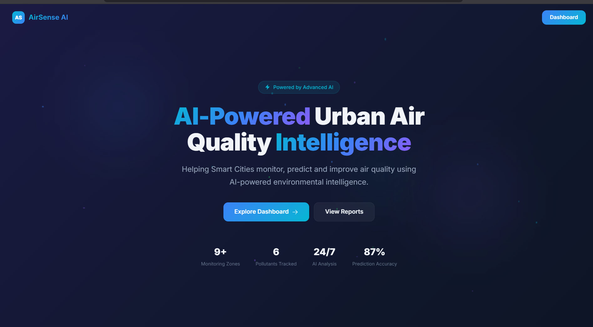
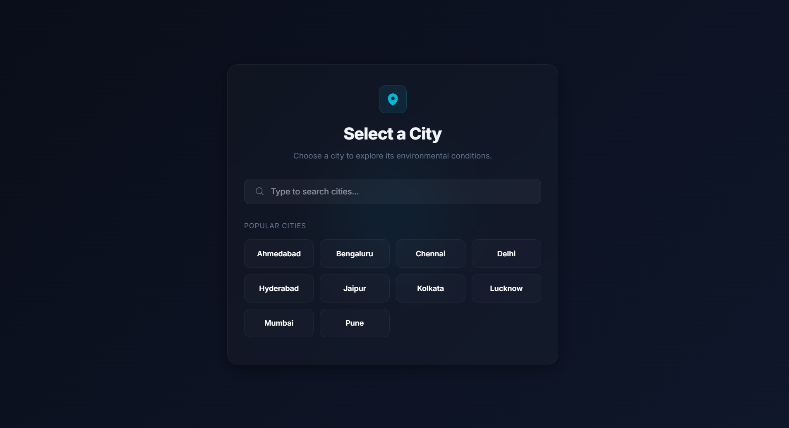
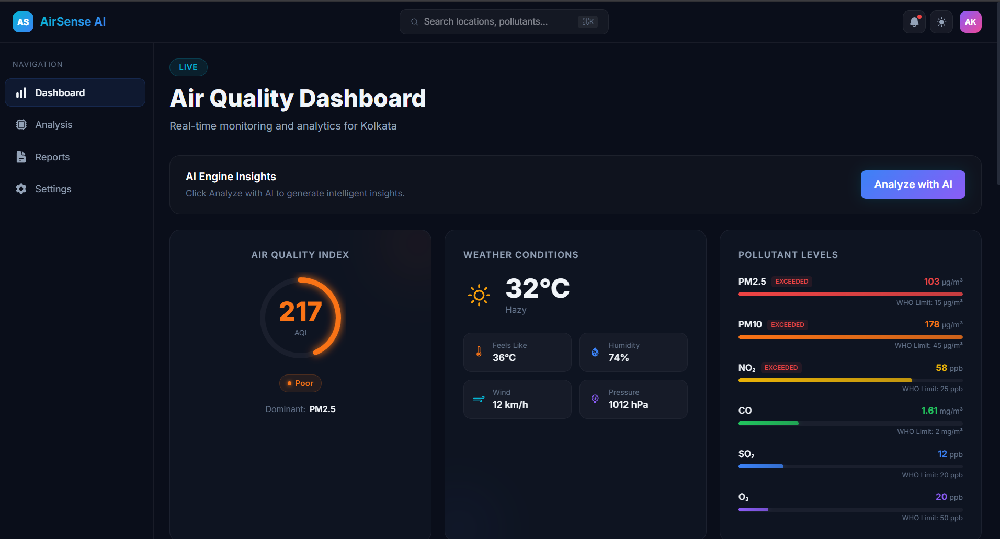
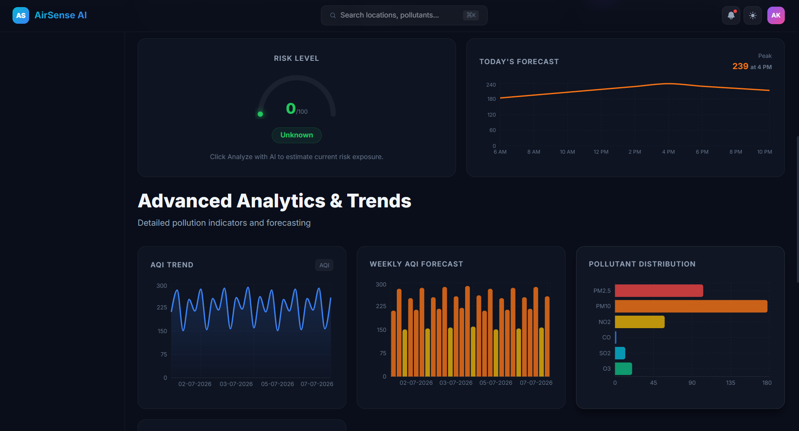
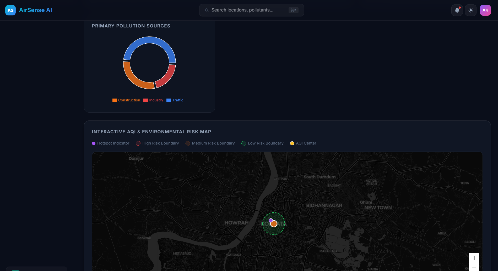
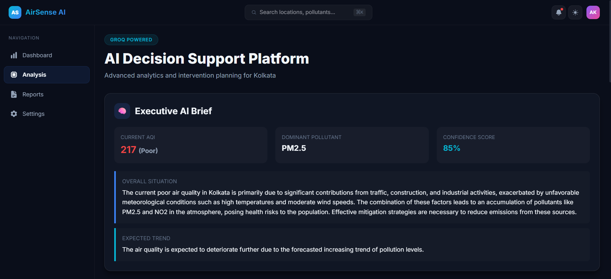
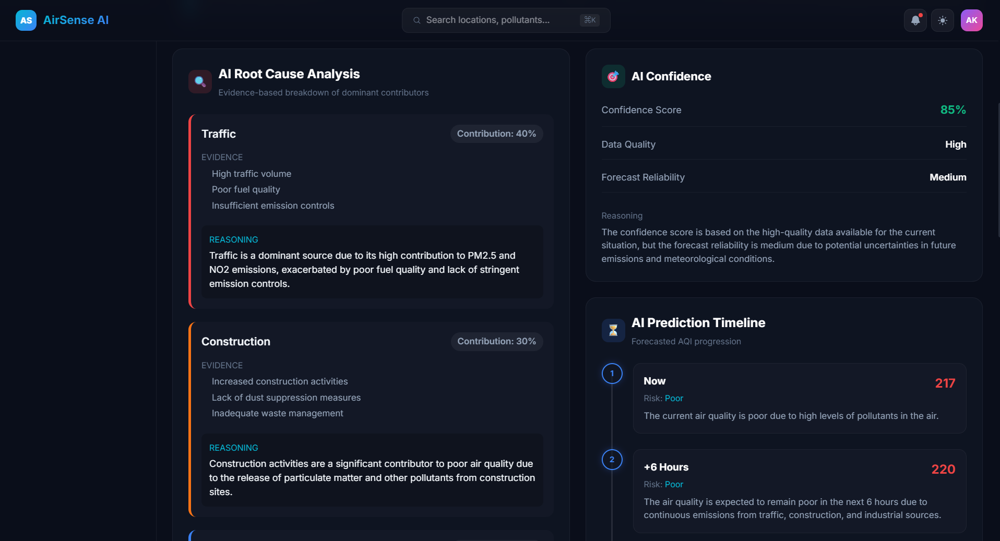
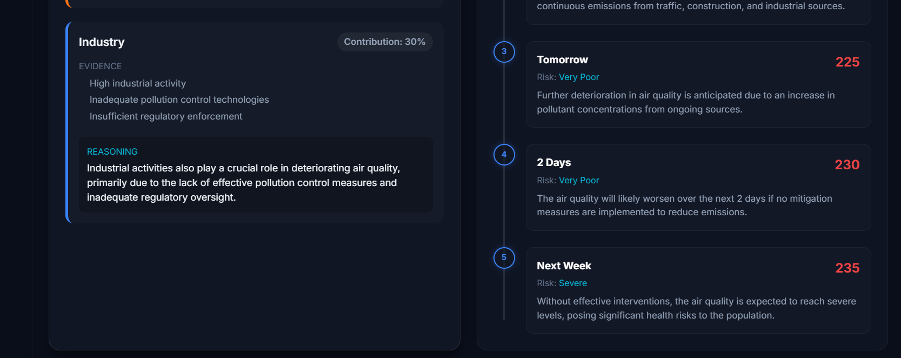
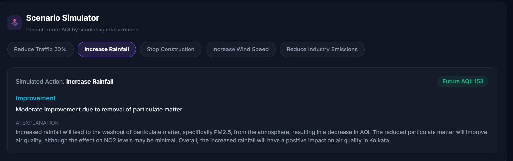
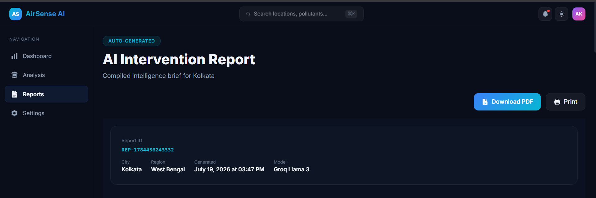

# 🌍 AirSense AI 🤖

**Smart City Air Quality Intelligence Platform**

*Developed for ET AI Hackathon 2026 - Problem Statement 5: AI-Powered Urban Air Quality Intelligence for Smart City Intervention*

---

## 🏆 Project Overview

**Vision:**  
To develop a production-grade, AI-powered decision support platform that helps city authorities monitor, predict, analyze, and mitigate urban air pollution while providing actionable health advisories to citizens.

Unlike traditional AQI dashboards that merely display raw pollution numbers, **AirSense AI** is a true **Decision Support Agent**. It actively analyzes real-world environmental data, explains the underlying causes of pollution, predicts future trends, and recommends strategic interventions using state-of-the-art LLMs.

---

## 🎯 Problem Statement

Current air quality systems mainly provide monitoring dashboards but lack the intelligence to answer critical questions such as:
- *Why is pollution increasing right now?*
- *Which areas require immediate intervention?*
- *What specific policy actions should municipal authorities take?*
- *What precautions should vulnerable citizens follow?*
- *How will air quality change if we implement a specific policy?*

**AirSense AI** aims to bridge this gap by transforming raw environmental telemetry into human-readable, actionable intelligence.

---

## ✨ Key Features & Functionality

We have transformed raw environmental data into **actionable intelligence** through the following features:

### 1. 🧠 AI Decision Support Dashboard
- **Executive AI Brief**: Groq's Llama-3 automatically synthesizes complex pollution data into a high-level situational overview.
- **Etiology (Root Cause Analysis)**: The AI identifies the dominant contributors (e.g., Traffic, Construction, Industry), calculates their percentage contribution, and provides the meteorological and geographical reasoning behind it.
- **Recommendation Impact**: AI-driven municipal action plans that calculate the expected AQI reduction, implementation difficulty, and estimated time frame for critical interventions (e.g., Enhancing Public Transport, Implementing Emission Controls).
- **Data Reliability & Confidence**: Generates a confidence score based on the quality of evidence used for the analysis.

### 2. 🎮 Interactive Scenario Simulator
- A "What-If" prediction engine that allows municipal authorities to simulate policy interventions (e.g., "Reduce Traffic 20%", "Stop Construction").
- The backend queries the LLM with the city's current context and the proposed intervention, dynamically calculating the **Expected Future AQI**, estimating the **Impact**, and providing a detailed AI explanation of *why* the intervention would work.

### 3. 🗺️ Interactive AQI & Environmental Risk Map
- A fully interactive Leaflet map that dynamically tracks pollution across different cities.
- **Dynamic Overlays**:
  - 🟡 **AQI Center Markers**: Color-coded indicators representing the city's current AQI status.
  - 🟣 **Pollution Hotspots**: Automatically flags specific geographic coordinates as localized pollution clusters.
  - 🟢🟠🔴 **Environmental Risk Boundaries**: Renders dashed 1.2km radius risk zones (Low, Medium, High) visually alerting authorities to regional exposure threats.

### 4. 📊 Advanced Data Visualizations
- **AQI Trend Curves**: Line charts tracking pollutant trajectories.
- **Weekly Forecasting**: Bar charts projecting AQI fluctuations over a 7-day period.
- **Pollutant Distribution**: Vertical bar charts highlighting the relative presence of PM2.5, PM10, NO2, CO, SO2, and O3.
- **Source Attribution Donut**: A dynamic pie chart representing the source attributions mapped directly from the AI orchestrator's analysis response.

### 5. 🏥 Citizen Protection Directives
- Dynamically generated health advisories targeted at specific vulnerable demographic groups (e.g., Asthma Patients, Cyclists, Outdoor Workers, Schools).
- Advisories automatically scale in severity based on the current AQI and dominant pollutants.

### 6. 📄 Professional AI Intelligence Reports & PDF Export
- Compiles all AI components (Executive Brief, Root Causes, Timelines, Interventions, and Health Advisories) into a highly professional **Intervention Report**.
- Features a **1-Click PDF Download** utilizing client-side rendering (`html2canvas` & `jsPDF`). The PDF perfectly preserves the platform's stunning dark theme, formatting, and pagination across a multi-page intelligence brief designed for government officials.

---

## 🏗️ Architecture

AirSense AI is built using a modern, decoupled architecture designed for speed and scalability:

1. **Client Layer (React + Vite)**: Handles the premium dark-theme UI, complex state management for AI orchestrations, interactive maps (Leaflet), and PDF generation.
2. **API Gateway & Business Logic (Express + Node.js)**: Orchestrates data flow between the frontend, the environmental dataset, and the LLM inference engine.
3. **Data Layer**: A CSV-based dataset containing real-world meteorological and pollutant data for multiple cities.
4. **AI Inference Engine (Groq Llama-3)**: Provides ultra-fast, structured JSON responses based on complex engineered prompts.

---

## 🤖 AI Workflow (How it Works)

1. **Context Gathering:** When a city is selected, the Node.js backend pulls the real-time CSV data for that specific city (AQI, dominant pollutants, wind speed, temperature, etc.).
2. **Prompt Engineering:** The backend injects this highly specific telemetry into a strict system prompt (`analysis.prompt.js`).
3. **Inference & Generation:** Groq processes the context, acting as an environmental scientist. It dynamically determines logical root causes, calculates reasonable AQI reductions for interventions, and generates targeted demographic advice.
4. **Structured JSON parsing:** Groq returns the intelligence as a massive, strictly formatted JSON object.
5. **UI Rendering:** The frontend parses this JSON and maps it to the beautiful, responsive cards seen on the dashboard and PDF reports.

---

## 📸 Screenshots

*(Add your screenshots here before submitting!)*


### 🏠 Landing Page

 


### 🌍 City Selection

 


  ### 📊 Dashboard
  
 
 
 


  ### 🤖 AI Analysis
  





### 🧪 Scenario Simulator




### 📄 AI Intervention Report


📥 **Full Report:** [AirSense_AI_Intervention_Report.pdf](./docs/AirSense_Report_Kolkata_2026-07-19.pdf)

---

## 🛠️ Technical Stack

- **Frontend:** React 19, TypeScript, Vite, TailwindCSS, Framer Motion
- **Backend:** Node.js, Express
- **AI Engine:** Groq API (Llama-3.3-70b-versatile)
- **Maps:** Leaflet & React-Leaflet
- **Data Export:** jsPDF & html2canvas

---

## 🔮 Future Scope

- **Real-time IoT Integration:** Connect directly to hardware IoT sensors (IoT MQTT streams) for live, sub-minute telemetry rather than CSV datasets.
- **Computer Vision API:** Integrate satellite imagery or traffic cameras to visually detect dust or smog and correlate it with AQI readings.
- **Mobile Application:** Build a React Native app with push notifications to alert citizens in real-time when they enter high-risk boundaries.
- **Automated Policy Enforcement:** Connect the backend directly to smart traffic light systems to automatically redirect traffic away from high-pollution hotspots.

---

## 🚀 Getting Started

1. **Clone the repository**
2. **Install Frontend Dependencies:** 
   ```bash
   cd frontend
   npm install
   ```
3. **Install Backend Dependencies:**
   ```bash
   cd server
   npm install
   ```
4. **Environment Setup:** 
   Create a `.env` file in the `server` directory and add your Groq API Key:
   ```env
   GROQ_API_KEY=your_api_key_here
   PORT=5000
   ```
5. **Run the Backend Server:**
   ```bash
   cd server
   npm start
   ```
6. **Run the Frontend Application:**
   ```bash
   cd frontend
   npm run dev
   ```

*Built with ❤️ for the Smart Cities of the Future.*
